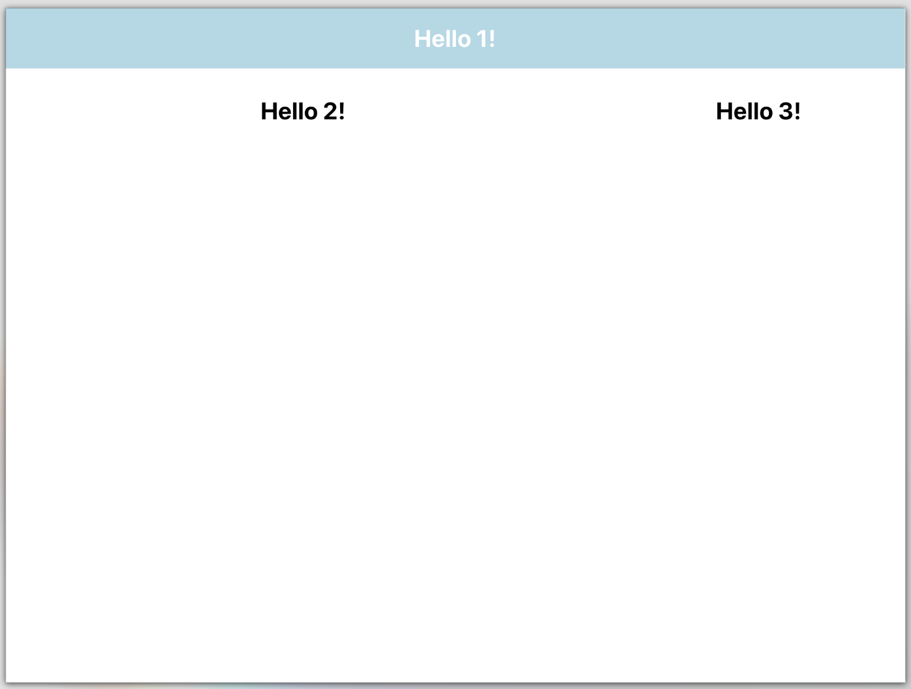

# Lab 4:  Getting Started with React

Now that we have created the Bike app using HTML5, CSS, and Javascript, in this lab we will introduce React, a library that can do much of the work for us.

React is an open-source front-end Javascript library for easily building interactive UIs.

In this lab, you will learn to:
- Create a React application

## Step-by-Step Tutorial

☑️ **Step 0:** Fork this repository ([Help](https://help.github.com/en/github/getting-started-with-github/fork-a-repo)) so that you have a copy of if in your Github account. 

☑️ **Step 0a:** Clone your *lab4* repository so that you have a local copy on your computer

☑️ **Step 1:** Installing npm/node
- Download Node.js [here](https://nodejs.org/en/download/)
- Follow this tutorial [here](https://radixweb.com/blog/installing-npm-and-nodejs-on-windows-and-mac) for installing Node.js and npm (node package manager) on Windows or Mac

☑️ **Step 2:** Installing React
- In the Command Prompt, type `node -v` to make sure that node is completely installed. It should return with a version number.
- In the Command Prompt, type `npm -v` to make sure that node is completely installed. It should return with a version number.
- Now run the command: `npm i -g create-react-app`. This will globally install React app for you.

☑️ **Step 3:** Create React App
- Now, navigate in the Command Prompt to where you want to create your React application. This should be inside the cloned *lab4* repository. Do this by using the `cd` command.
- Once you are inside your chosen folder, run the command: `npx create-react-app YOUR_APP_NAME`. It will take some time to install the required dependencies, so make sure to keep the window open.
- Now, in your IDE of choice (ex. Visual Studio Code), open the folder where you have installed the React app. Here, you can see all the files that have been created for you.

**Command Prompt Navigation Reference**
- If you type `cd NAME_OF_FOLDER` you will move into the chosen folder. (This must be a folder directly accessible from the folder you are in.) 
- If you type `cd ..` you will go to the directory one above the directory you are currently in.
- If you type `pwd` you will see what folder you are in and the absolute path.

☑️ **Step 4:** Start the application
- Back in the Command Prompt, use `cd REACT_FOLDER_NAME` to navigate into the new folder created by `create-react-app`.
- In that folder, run the command: `npm start`. This will open a new tab in your browser showing the React logo.


Congratulations! You know have a basic application running with React! In React, you can make changes to the code and see them in real time on the React application without having to rebuild.

☑️ **Step 5:** Install Material UI

React allows us to easily install libraries to make development easier. [Material UI](https://mui.com/) is a React component library that implements many pre-built UI components. [Here is the documentation](https://mui.com/material-ui/getting-started/overview/) for MUI.
- Stop the React server with `CTRL + C` (press CTRL and C at the same time on your keyboard. You can install the Material UI library using the following command `npm install @mui/material @emotion/react @emotion/styled`. Restart the React server by running the `npm start` command.

☑️ **Step 6:** Add a Grid to the page
- Import the Button, TextField, Grid, and Box components from the Materials UI library by adding the following import statement at the top of the src/App.js file.
```
import {Button, TextField, Grid, Box} from '@mui/material';
```

Replace the content within the `<div className="App" ... </div>` tags with the following code snippet.

```
<Grid container spacing={2}>
  <Grid item xs={12} justifyContent="center" alignItems="center" backgroundColor="lightBlue">
    <h1>Hello 1!</h1>
  </Grid>
  <Grid item xs={8} display="flex" justifyContent="center" alignItems="center">
    <h1>Hello 2!</h1>
  </Grid>
  <Grid item xs={4} display="flex" justifyContent="center" alignItems="center">
    <h1>Hello 3!</h1>
  </Grid>
</Grid>
```
Here, we use the Grid component to split the page into parts. Each Grid element can have a size of 1 to 12. Every 12, it goes on a new line. For example, we used a Grid component to split the page into a two rows. The first row of width 12 (max-width) acting as a nav bar. The second row split in two columns of width 8 and 4 respectively. You can learn more about the Grid layout at [MUI > Grids > Fluid grids > Basic grid](https://mui.com/material-ui/react-grid/#basic-grid).

The webpage in your browser should have autoreloaded and should show something like the following:


☑️ **Step 7:** Add a title to the first grid element and remove the placeholder `<h1>`

```
<h1 style={{color:'white'}}>Human Computer Interaction Newsletter</h1>
```


☑️ **Step 8:** Add a button and and text field to the second grid element and remove the placeholder `<h1>`

Add the following to the second grid element. This will create a paragraph, text field, and button on your webpage.

```
<p>Signup for the human computer interaction newsletter!</p>
<TextField id="outlined-basic" type="email" label="email@wpi.edu" variant="outlined" style={{marginRight: '20px'}}/>
<Button variant='contained' onClick={Popup}>Sign Up</Button>
```
Before your page can compile correctly, we need to add one more thing. The button is set to call a Popup function on click (`onClick={Popup}`). We need to add a function named Popup to our code. Add the following snippet of code outside and before the `function App()` definition in your src/App.js file. 

```
function Popup() {
  alert('Signup successful!')
}
```

☑️ **Step 9:** Add an image to the third grid element and remove the placeholder `<h1>`
```
<Box
  component="img"
  sx={{
    height: '100%',
    width: '100%',
  }}
  alt="A react logo"
  src={logo}
/>  
```

**Notice** Our template code that was generated when creating the React app also imported the React logo using the following line in src/App.js `import logo from './logo.svg';`. We can pass directly the `logo` variable to the src field to render the image. Feel free to change this image if you'd like.


☑️ **Step 10:** Publish on gh-pages
To publish a React app online, it will need to be built.
- Stop the React server using `CTRL + C` as before. 
- Open the `package.json` file and add `"homepage": ".",` like so: 

 

Make sure to save this file.

- While still in your React app folder in the Command Prompt, run the command `npm run build`. This will create a new folder called "build" with all the files needed for the build of your website.

- Take all the files out of the build folder and put them directly into the root git folder. The build files need to be at the root because otherwise they will not be found by gh-pages.
- Push this to GitHub.

- In the Settings for your repository on Github, go to the Pages tab.

Make sure it is deploying from a branch. Choose the branch with all your changes this is probably main). The website should be working at `yourGithubUsername.github.io/lab4/index.html`.

### Submit your work
On Canvas, submit the following: 
- a link to your Github repository
- a link to your Web page 
